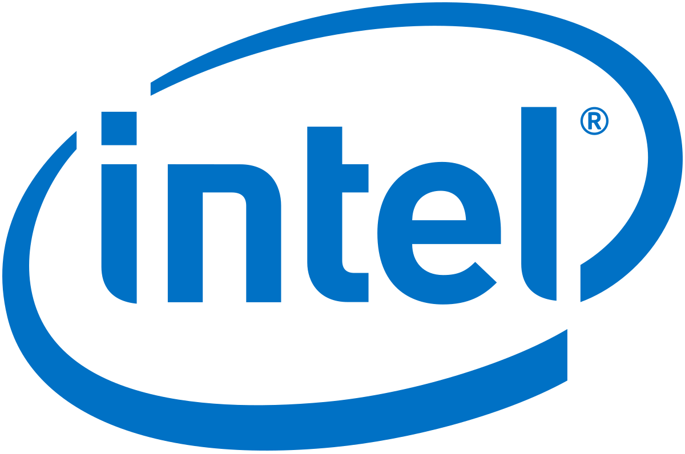

# 인텔코리아 강의자료 - 딥러닝을 이용한 객체 인식



 본 강의 자료는 인텔코리아에서 진행하는 딥러닝 관련된 교육 자료이므로 무단으로 사용시 법적 제재가 있을 수 있습니다. 

## 강의 목적
 Tensorflow API를 이용하여 다양한 객체 인식 모델을 학습 후 OpenVINO로 변환하여 추론해보는 튜토리얼입니다.

## 환경 설정
 모든 강의자료는 아나콘다를 통해 가상환경을 생성한 뒤 아래와 같은 명령어를 통해 환경설정을 할 수 있습니다. 괄호 안은 가상환경의 이름이므로 괄호 이후 문자열을 복사하여 터미널에 입력해주시길 바랍니다. Tensorflow와 Keras 등 필수적인 라이브러리의 버전은 설치 후 확인 바랍니다.

> Tensorflow: 1.14  
OpenVINO: 2020.2.0

```bash
> git clone https://github.com/gradient-lab/intel-object-detection.git
> cd intel-object-detection
> pip3 install virtualenv
> virtualenv venv
> (venv) source venv/bin/activate  
> (venv) pip3 install -r requirements.txt
> (venv) jupyter notebook .
```

## 데이터 및 모델
 강의에서 사용할 자료는 [Google Drive](https://drive.google.com/drive/folders/1YIFbhaCjaIQRsWTVaq6o6h9FFjdQ9Zkr?usp=sharing)에 업로드에 되어있습니다. 여기서 자료를 다운로드 후 사용하시길 바랍니다. `data`라는 폴더를 생성 후 압축을 해제해주시길 바랍니다. 만약 다운로드에 어려움이 생긴다면 `minsuksung@korea.ac.kr`로 연락주시길 바랍니다. 해당 튜토리얼에서 활용된 자료는 아래를 참고하였습니다.

## 강의 구성
 기본적으로 본 예제는 중/고등학생 및 비전문가도 쉽게 딥러닝을 이용할 수 있게 구성된 Tensorflow API를 활용하여 객체 인식해보는 예제입니다. 1강은 MSCOCO Dataset으로 미리 학습(pre-trained)된 Faster R-CNN으로 추론하는 예제부터 마지막에선 Tensorflow 버전의 모델을 OpenVINO 버전의 모델로 변환하여 속도를 증가시키는 방법을 배웁니다.

|차수|내용|
|---|---|
|1강 |Tensorflow API를 이용하여 Pretrained Model로 Object Detection|
|2강 |Tensorflow API를 이용하여 Faster R-CNN 학습하기|
|3강 |Tensorflow API를 이용하여 MobileSSD 학습하기|
|4강 |Tensorflow pb 파일을 OpenVINO xml,bin 파일로 변환 후 추론하기|

## 참고
- Intel Korea : https://www.intel.co.kr/content/www/kr/ko/company-overview/company-overview.html
- Intel OpenVINO : https://software.intel.com/en-us/openvino-toolkit
